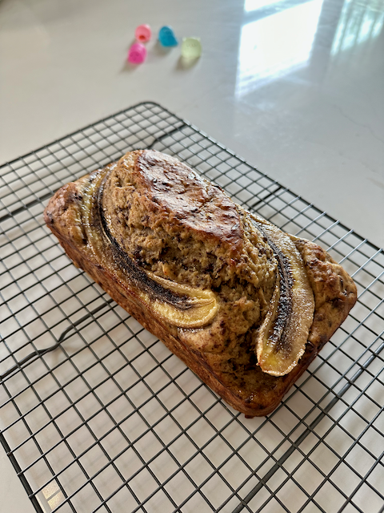
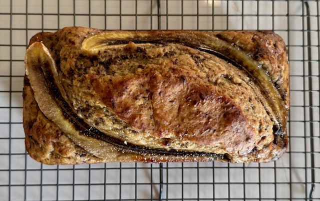

This recipe comes from [Popote et Potager](https://www.youtube.com/@popoteetpotager), [BANANA BREAD Recette facile et anti gaspi](https://youtu.be/CCDTuorw1ro). The bread (or cake, depending on your definition) is sweetened only by the bananas and chocolate. The recipe yields a dense, moist bread packed with banana flavor.

## Yield
- 1 loaf

## Special Equipment
- 1 1.5 to 1 pound loaf pan

## Preheat Oven
- Preheat oven to 350°F or 180°c.
- Adjust oven rack to middle position.

## Ingredients
- 5 ripe to slightly over-ripe bananas, peeled.
  - 4 mashed
  - 1 whole, sliced length-wise
- 2 large eggs
- 1 packet (7 grams) active dry yeast
- 100 grams dark chocolate (70%), finely chopped

## Preparation
- Butter/flour (I use *Baker's Joy*) loaf pan and line the bottom of the loaf pan with parchment paper.
- In a medium sized bowl, **mash 4 of the bananas**.
- Add the **two eggs** to the mashed bananas and mix well using a whisk. 
- Combine the **flour** and **dry yeast**. Sift into the bowl atop the banana/egg mixture. Beat well using a sturdy whisk or heavy mixing spoon.
- Add the finely chopped **chocolate** and mix well.
- Pour the batter into the prepared loaf pan.
- With the two halfs of the remaining sliced banana, arrange the two halfs, cut-side up, atop the batter. Gently press the banana slices into the batter till set and even.

## Bake
- Bake **45 minutes**.
- Remove from oven and let cool in pan for 10 minutes.
- Turn out the banana bread from pan and let cool on wire rack.

