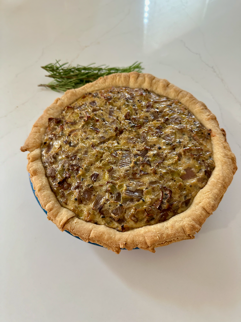
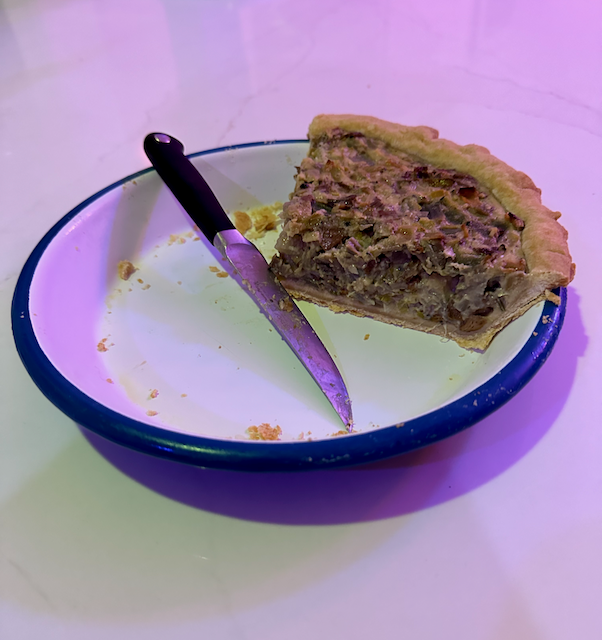

This savory pie is a simple, rustic dish that is perfect as a side dish or a main. Top with a drizzle of balasmic vinegar and a sprinkle of fresh herbs. Serve hot, cold, or room temperature. This pie was an entry to the [Porches and Pies](https://www.porchesandpies.com/) pie contest in 2023.

## Notes
- This recipe requries one pie shell (half a recipe) of [Pâte Brisée]( "Pâte Brisée").
- Any mix of fresh mushrooms can be used. I used a mix of oyster and shiitake.
- While this recipe calls for oat milk, any milk can be used.

## Yield
- One - 9 inch (23 cm) pie

## Ingredients
- 770 grams trimmed and cleaned oyster and other mixed mushrooms
- 1 large purple onion
- 2 to 3 small/medium shallots 
- 3 leeks, white stalk and tender green stalks chopped into ¼ rounds and then thinly sliced
- 3 to 4 Rosemary sprigs
- 3 to 4 Thyme sprigs
- 2 large eggs
- 80 ml (1/3 cup) oat or other milk
- 145 grams (or 5 oz) finely grated parmesan cheese
- 1 pie shell from [Pâte Brisée]( "Pâte Brisée")

## Preparation
### Mushrooms
In a large, heavy skillet, add: 
- mushrooms
- sprig of rosemary
- sprig of thyme
- salt
- pepper
- splash of water

Cook over medium heat until water evaporates. Add some olive oil and cook till mushrooms are lightly browned. Discard rosemary and thyme. Move cooked mushrooms to a bowl and set aside.

### Onions and Leeks
To the empty skillet, add: 
- onions
- leeks
- shallots
- sprig of rosemary
- sprig of thyme
- salt
- pepper

Add olive oil and cook over medium heat until onions caramelize, about 30 minutes. Discard rosemary and thyme. Add mushrooms to onion/leek mixture and cook another 15 minutes over low heat. Pour onion/leek/mushroom mixture into large bowl and let cook till room temperature. 

### Prepare Pie Crust
While mixture cools, prepare one 9” pie plate. Roll out dough (1/2 of recipe) to fit a 9” pie pan. Place dough in pie pan and situate as needed. If using glass or ceramic pie pan, bind bake crust and cool.

### Combine and bake
- Preheat oven to 175℃ (350℉).
- To the onion/leek/mushroom mixture, add eggs, milk, and cheese; stir to incorporate. 
- Pour mixture over prepared pie crust.
- Bake at 175℃ (350℉) for about 40 minutes until top is lightly browned. Let cool. Serve with balsamic vinegar and fresh herbs.

