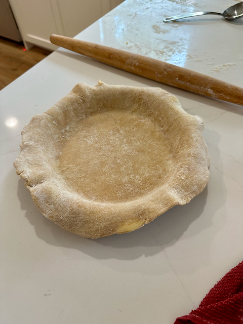

This is a very simple pie crust recipe that comes together quickly. The crust is tender and flaky due to the use of vodka (which does not contribute to gluten formation) and plenty of cold butter. It is important to not overwork the dough; the goal is a rough/shaggy looking crust with large chunks of butter throughout. The crust can be used for both sweet (add the sugar as directed) and savory pies (omit sugar).

This crust is so easy to make, there's no excuse to use store-bought crusts!

## Notes
- This recipe requries cold ingredients and a cold work surface.
- The vodka in this recipe is used to inhibit gluten formation, which makes the crust more tender. The alcohol evaporates during baking, so there is no alcohol in the finished crust.
- While the vodka/water mixture is chilling in the freezer, cut the butter into cubes and place in the refrigerator.
- For extra measure, place the flour/salt/sugar mixture in the freezer for 15 minutes before making the dough.
- For a more flavorful crust, use cultured butter.
- Additionally, up to 25% of the all-purpose flour can be replaced with whole grain flour (spelt, whole wheat, rye, etc.).
- When rubbing the butter into the flour, the goal is to have large, rough chunks/sheets of butter throughout the dough. The dough should not be uniform and shuold look marbled.
- You should have left over vodka/water mixture. 

## Yield
- Two - 9 inch (23 cm) pie shells

## Ingredients
- 120 ml (½ cup) vodka
- 120 ml (½ cup) water
- 340 grams (3 sticks) cold unsalted butter, cut into cubes (½ to 1 cm / ¼ to ½ inch)
- 485 grams (3 ¾ cup) all purpose flour
- Pinch of salt
- 30 ml (⅛ cup) sugar, if making a sweet pie

## Preparation
### Vodka and Water
- Combine vodka and water in a properly sized container, cover, and place in the freezer for at least 15 minutes.

### Butter and Flour
- Combine flour, salt, and sugar (if using) in a large bowl.
- Add chilled butter.
- Using your fingers, toss the butter in the flour to coat. 
- Rub the butter into the flour just until minimally combined.

### Add liquid
- Add about ¼ of the vodka/water mixture to the flour/butter mixture.
- Gently toss the mixture with your fingers to combine. The dough should be shaggy and not hold together.
- Add a little more vodka/water, as needed (no more than ¼ of the liquid at a time), and toss just till the dough holds together. The dough should still be shaggy and rough.
- Turn dough out onto a clean work surface and gently knead the dough just until it comes together.

### Layer, Divide, and Chill
- Form the dough into a rough rectangle.
- Using a bench scraper or chef's knife, divide the dough into three equal pieces.
- Stack the three pieces on top of each other and press down to form a rectangle.
- Repeat the process to divide into three parts, stack the dough, and form into a rectangle.
- Divide the dough into two equal pieces.
- Wrap each piece in plastic wrap and refrigerate for at least 1 hour or up to 2 days (or freeze for up to a month).

## Use
- If frozen, let the dough thaw before use.
- Unwrap the dough and place on a lightly floured work surface.
- Using a rolling pin, roll the dough into a circle about 3 inches (7.5 cm) larger than the pie pan.
- Transfer the dough to the pie pan and gently form into the pan.
- Trim the edges of the dough to about 1 inch (2.5 cm) larger than the pie pan.
- Fold the edges of the dough under itself and crimp the edges.
- Chill the dough in the refrigerator for at least 30 minutes before baking.
