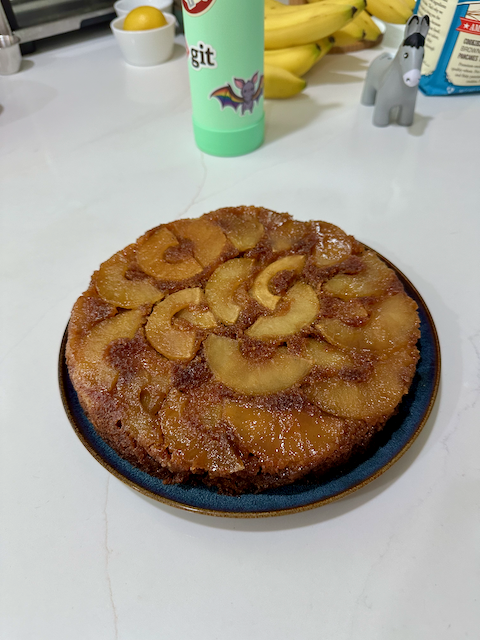

## Source

https://marissarothkopf.substack.com/p/hazelnut-honey-spice-cake-with-caramelized

## Ingredients

### For the caramel:
- **3** medium apples (e.g., 2 Granny Smith and 1 Gala)
- Fresh lemon juice
- **57 grams (4 tablespoons)** unsalted butter
- **50 grams (1/4 cup)** granulated sugar
- **85 grams (1/4 cup)** honey
- **1/2 teaspoon** vanilla extract
- **1/2 teaspoon** salt

### For the cake:
- **71 grams (1/2 cup)** all-purpose flour
- **71 grams (1/2 cup)** hazelnut flour
- **3 tablespoons** corn starch
- **1 teaspoon** baking powder
- **1/2 teaspoon** baking soda
- **1/2 teaspoon** salt
- **1 teaspoon** ground cinnamon
- **1/2 teaspoon** freshly grated nutmeg
- **100 grams (1/2 cup)** granulated sugar
- **169 grams (12 tablespoons)** unsalted butter, room temperature
- **127 grams (1/4 cup)** honey
- **3** large eggs, room temperature

## Instructions

1. **Prep the pan and oven:** Preheat the oven to 350°F (180°C). Butter a 9” cake pan and line the bottom with parchment paper.
2. **Prepare the apples:** Peel, core, and thinly slice the apples. Toss with lemon juice.
3. **Make the caramel:** In a medium saucepan, melt butter over medium-low heat. Stir in honey and sugar until the mixture turns light brown. Remove from heat, and stir in vanilla and salt.
4. Pour the caramel into the cake pan. Arrange apple slices on top of the caramel.
5. **Make the cake:** In a medium bowl, whisk together the dry ingredients. In another bowl, cream together butter, honey, and sugar. Add eggs one at a time, then gradually mix in the dry ingredients.
6. Spoon the batter over the apples, spreading it evenly to the edges of the pan.
7. Bake for 30 minutes. If the center still wiggles, reduce the heat to 325°F and bake for an additional 5 to 10 minutes.
8. Let the cake cool for about 15 minutes, then invert onto a plate. Remove the parchment and rearrange any apples as needed.

Serve warm or at room temperature. Best if made within 24 hours of serving.
